<div align="center">

# 🛠️ Workshop Job Tracker

**An enterprise-grade workshop management, repair job lifecycle tracking, hardware CRM, parts inventory control, and automated billing system.**

[](https://nodejs.org/)
[](https://expressjs.com/)
[](https://react.dev/)
[](https://vitejs.dev/)
[](https://www.mysql.com/)
[](http://localhost:3000/api-docs)
[](https://jwt.io/)
[](LICENSE)

<p align="center">
  <a href="#-quick-preview">Screenshots</a> •
  <a href="#-key-features">Key Features</a> •
  <a href="#-system-architecture">Architecture</a> •
  <a href="#-tech-stack">Tech Stack</a> •
  <a href="#-quick-start">Quick Start</a> •
  <a href="#-security--access-control">Security</a> •
  <a href="#-api-documentation">API Docs</a> •
  <a href="#-database-schema">Database Schema</a>
</p>

---

</div>

## 📸 Quick Preview

### 📊 Executive Analytics & KPI Dashboard
Real-time workshop health metrics, active repair counts, monthly revenue totals, urgent job cards, and automated low-stock inventory alerts.

<div align="center">
  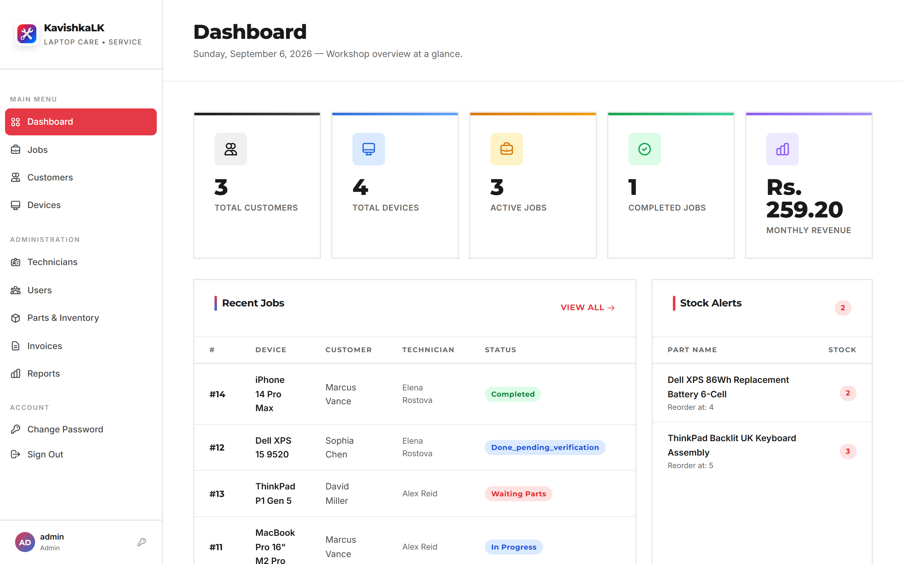
</div>

<br />

### 🖼️ Core Modules Showcase

<table>
  <tr>
    <td width="50%">
      <h4 align="center">📋 Real-Time Job & Work Order Tracking</h4>
      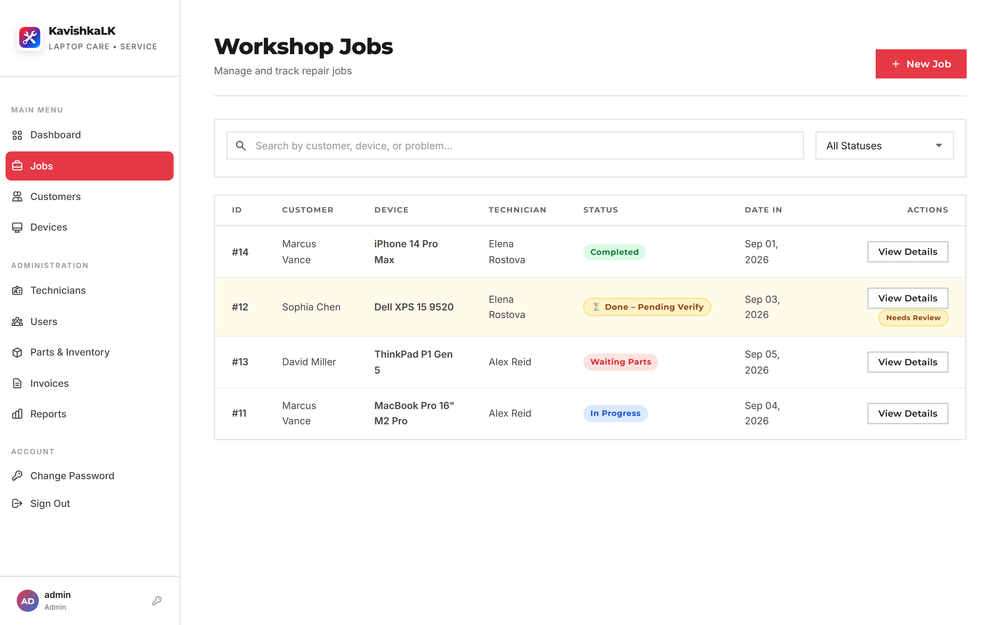
      <p align="center"><em>Live status pipeline, priority flags, verification review alerts, and quick actions.</em></p>
    </td>
    <td width="50%">
      <h4 align="center">📦 Spare Parts Stock & Inventory Control</h4>
      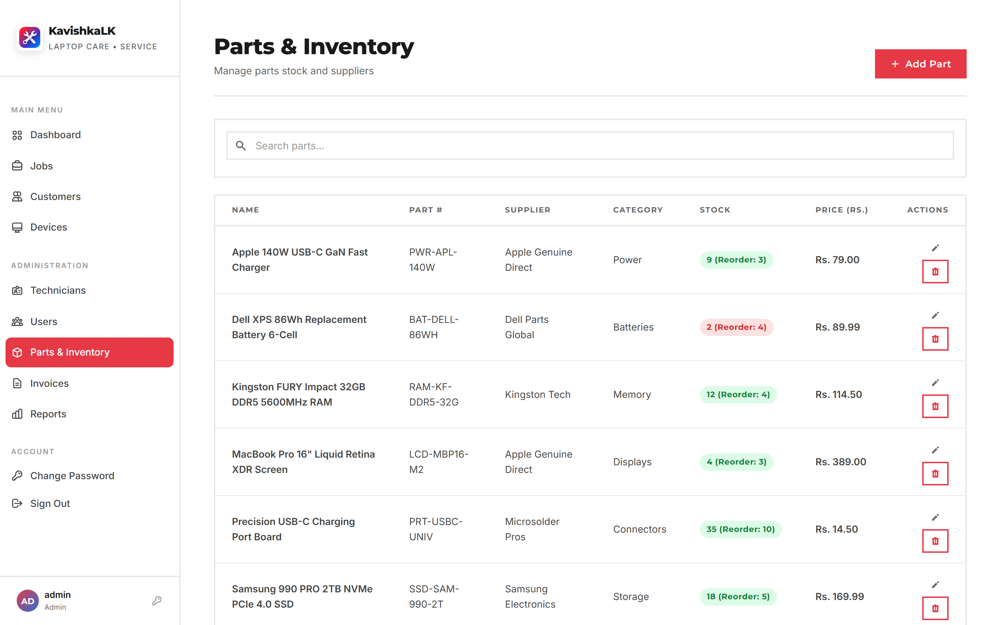
      <p align="center"><em>SKU tracking, automated low-stock warnings, supplier details, and unit pricing.</em></p>
    </td>
  </tr>
  <tr>
    <td width="50%">
      <h4 align="center">🧾 Invoicing, Billing & Payment Processing</h4>
      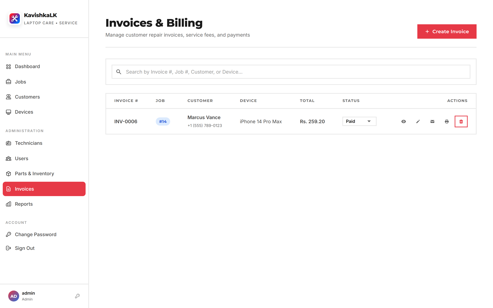
      <p align="center"><em>Auto-calculated labor & parts cost, tax breakdowns, and payment status tracking.</em></p>
    </td>
    <td width="50%">
      <h4 align="center">💻 Device & Hardware Asset Registry</h4>
      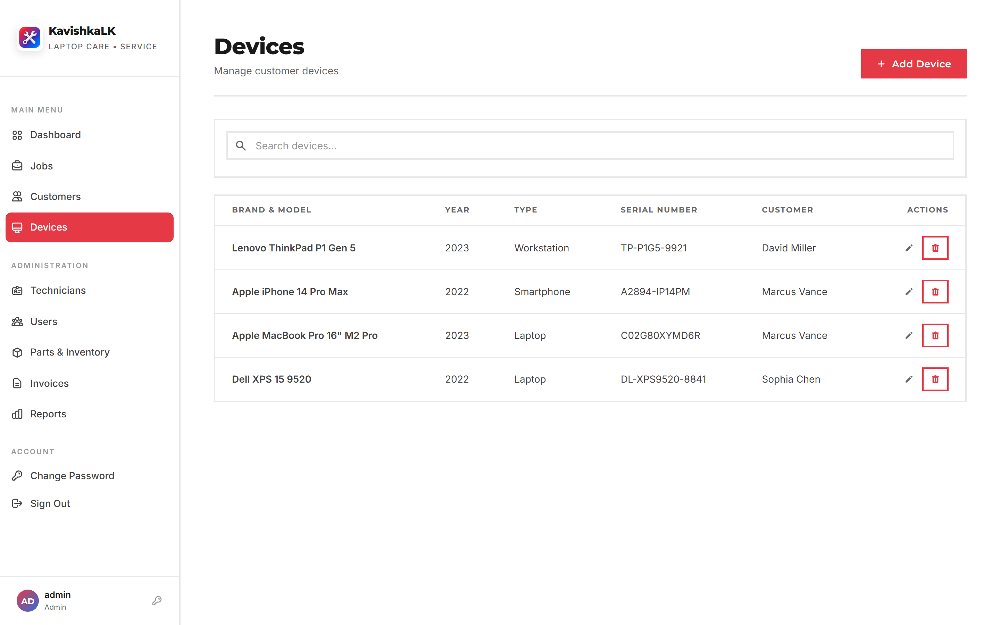
      <p align="center"><em>Client device tracking by brand, model, serial number, year, and type.</em></p>
    </td>
  </tr>
  <tr>
    <td width="50%">
      <h4 align="center">👥 Customer Relationship Management (CRM)</h4>
      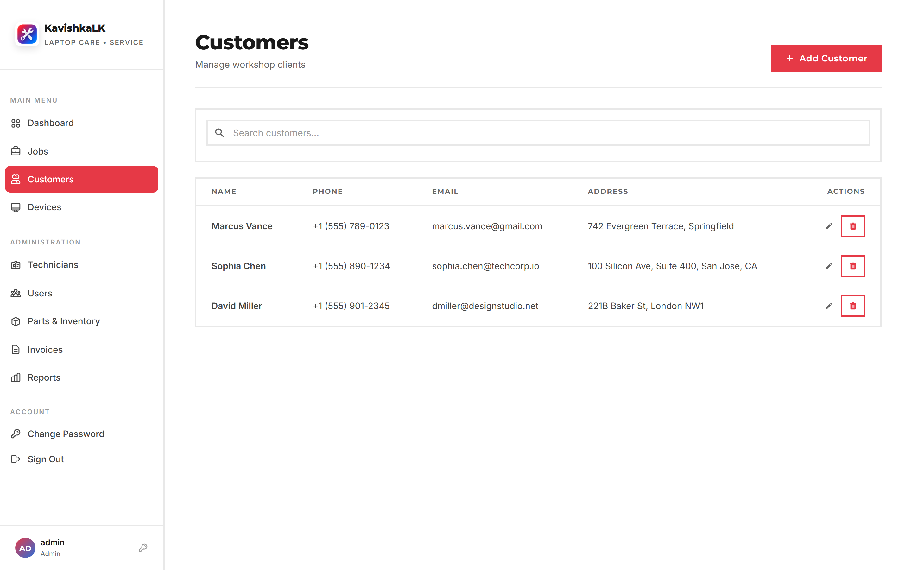
      <p align="center"><em>Centralized customer directory with phone, email, and service history.</em></p>
    </td>
    <td width="50%">
      <h4 align="center">📊 Financial & Operational Reports Suite</h4>
      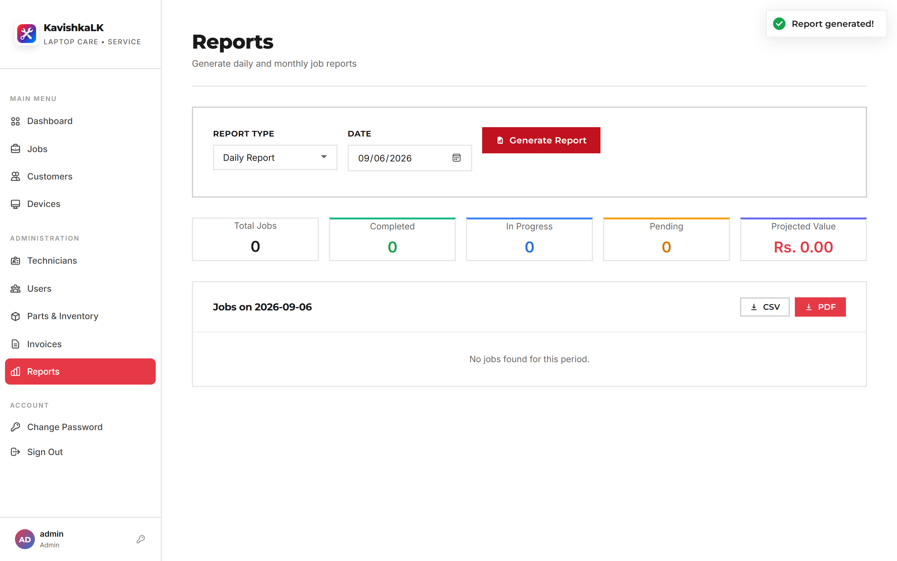
      <p align="center"><em>Daily & monthly performance reporting with instant CSV & PDF export capabilities.</em></p>
    </td>
  </tr>
  <tr>
    <td width="50%">
      <h4 align="center">👨‍🔧 Technician Staff & Roster Management</h4>
      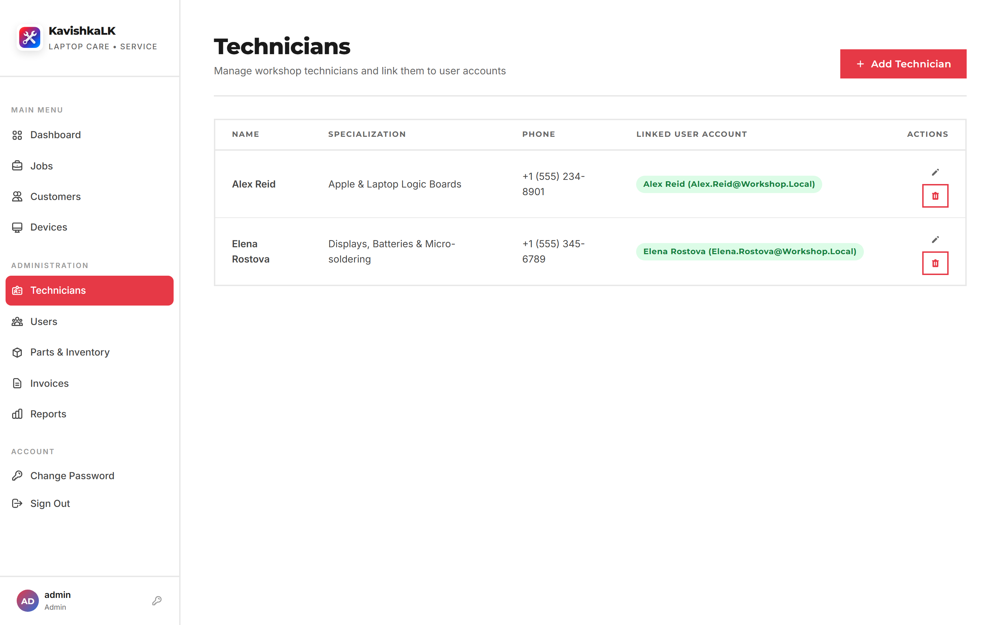
      <p align="center"><em>Specializations, linked system user credentials, and workload dispatching.</em></p>
    </td>
    <td width="50%">
      <h4 align="center">📖 Interactive Swagger OpenAPI 3.0 Explorer</h4>
      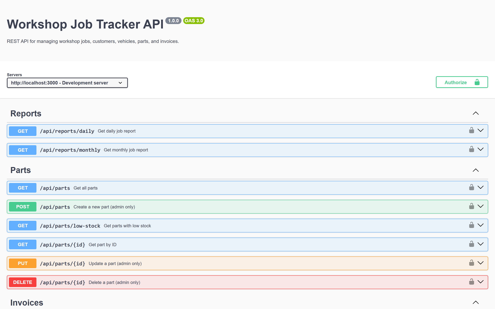
      <p align="center"><em>Interactive API documentation with live endpoint testing and authorization headers.</em></p>
    </td>
  </tr>
</table>

<details>
<summary><b>🔐 Click here to view the Secure Sign-In Portal Screenshot</b></summary>
<br>
<div align="center">
  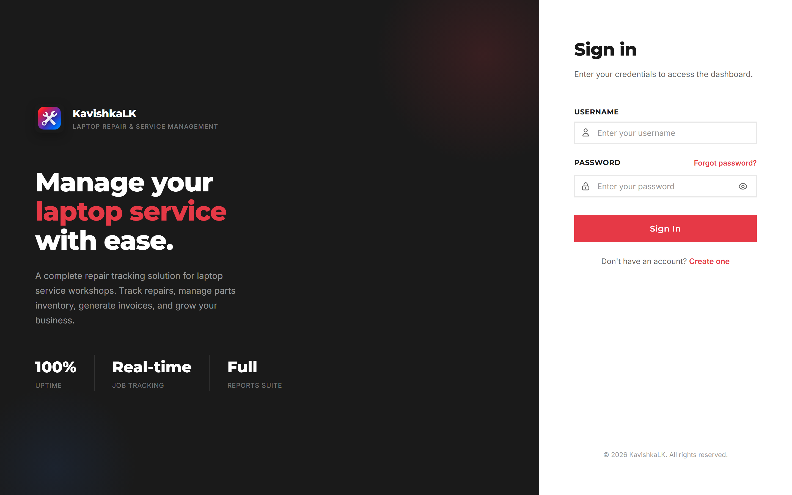
</div>
</details>

---

## ✨ Key Features

- **End-to-End Job Lifecycle Management**: Track repair tickets from intake to delivery across 7 distinct states: `pending`, `assigned`, `in_progress`, `waiting_parts`, `done_pending_verification`, `completed`, and `delivered`.
- **Admin Verification & Quality Control**: Technicians submit jobs for verification; Administrators review, approve, or reject repair work with automated email notifications dispatched upon status changes.
- **Hardware & Asset Registry**: Comprehensive tracking of laptops, desktop workstations, smartphones, and tablets linked directly to customer profiles and repair history.
- **Parts & Inventory Tracking**: Spare parts catalog with SKU/Part number, unit pricing, real-time quantity deductions upon repair usage, and color-coded low-stock alerts.
- **Automated Invoicing Engine**: Auto-computed invoices calculating parts totals, labor hours, tax rates, and grand totals with instant status tracking (`unpaid`, `paid`, `partial`).
- **Comprehensive Reporting & Export**: Daily and monthly financial and operational summaries exportable to **PDF** (via jsPDF) and **CSV** (via PapaParse).
- **Role-Based Access Control (RBAC)**: Secure multi-tier authentication (`Admin` vs `Technician / Employee`) with tokenized authorization guards.
- **Email Notifications**: Integrated SMTP mailer for job verification requests, approval notices, and password reset codes.
- **Interactive OpenAPI / Swagger Documentation**: Full RESTful API documentation at `/api-docs` with schema models and try-it-out execution.
- **Production Audit Logging**: Winston-powered structured logging to file (`combined.log`, `error.log`) and database action audit trail.

---

## 🔄 Job Lifecycle & Verification Workflow

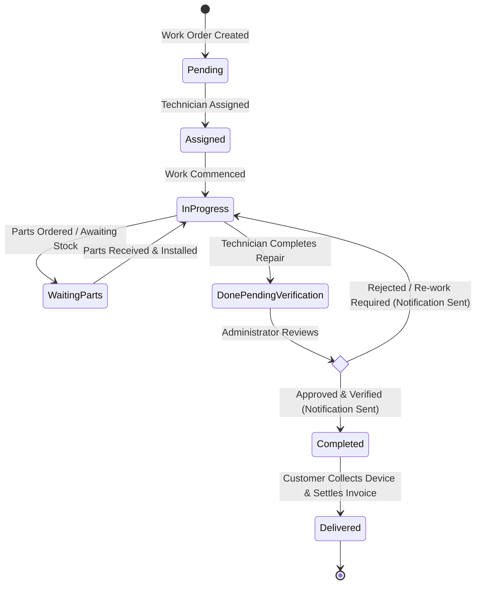

---

## 🏗️ System Architecture

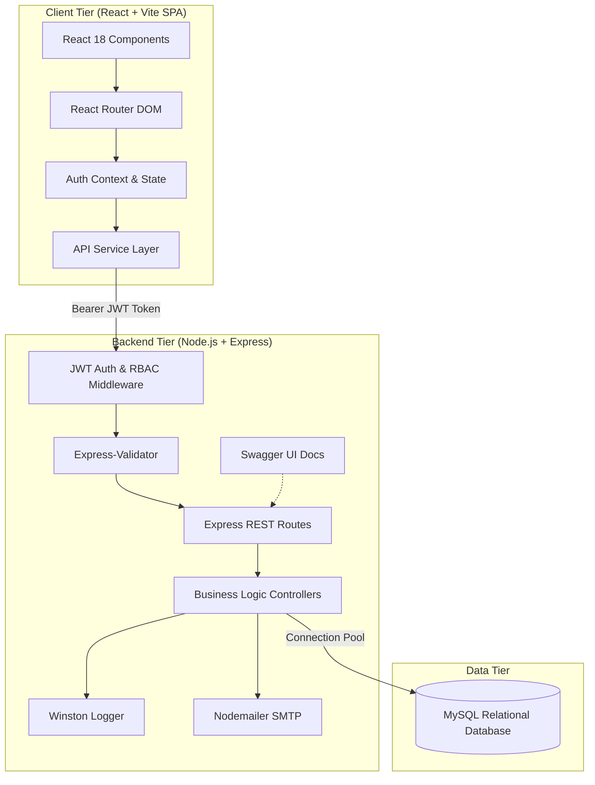

---

## 💻 Tech Stack

| Layer | Technology | Purpose |
|---|---|---|
| **Frontend Framework** | React 18 | Declarative component UI |
| **Build Tool** | Vite 5 | Lightning-fast development & production bundling |
| **Routing** | React Router DOM v6 | Single Page Application client-side navigation |
| **Icons & Styling** | React Icons (`react-icons/hi`) + Custom CSS | Accessible modern iconography & responsive styling |
| **Feedback / Notifications**| React Hot Toast | Lightweight, responsive toast alerts |
| **Backend Runtime** | Node.js (v18+) | High-performance server-side JavaScript runtime |
| **Server Framework** | Express.js 4.19 | REST API routing and middleware pipeline |
| **Database** | MySQL 8.0+ | Relational persistence, constraints & foreign keys |
| **Database Driver** | `mysql2/promise` | Async/await connection pooling and parameterized SQL |
| **Authentication** | JSON Web Tokens (`jsonwebtoken`) + `bcryptjs` | Stateless authentication & cryptographic password hashing |
| **Security Headers** | `helmet` + `cors` | HTTP header protection & cross-origin controls |
| **Validation** | `express-validator` | Request payload sanitization and validation |
| **Logging** | Winston | File and console structured logging |
| **Documentation** | Swagger JSDoc & Swagger UI Express | OpenAPI 3.0 interactive documentation |
| **Reporting & Export** | jsPDF + PapaParse | Client-side dynamic PDF rendering and CSV generation |

---

## ⚙️ Prerequisites

Ensure the following tools are installed on your environment:

- **Node.js**: v18.0.0 or later ([Download Node.js](https://nodejs.org/))
- **npm**: v9.0.0 or later (comes bundled with Node.js)
- **MySQL**: v8.0 or later (Local MySQL Server, XAMPP, MariaDB, or remote cPanel MySQL)
- **Git**: For source control cloning

---

## 🚀 Quick Start

### 1. Clone the Repository

```bash
git clone https://github.com/kavishkadeshan20033/workshop-job-tracker.git
cd workshopjob
```

### 2. Configure the Database

1. Create an empty database in your MySQL instance (e.g. `workshop_db`):
   ```sql
   CREATE DATABASE workshop_db CHARACTER SET utf8mb4 COLLATE utf8mb4_unicode_ci;
   ```
2. Import the schema DDL located at `server/database/mysql_schema.sql`:
   - **Via MySQL CLI:**
     ```bash
     mysql -u your_user -p workshop_db < server/database/mysql_schema.sql
     ```
   - **Via phpMyAdmin / cPanel:**
     Open phpMyAdmin, select `workshop_db`, navigate to the **Import** tab, choose `server/database/mysql_schema.sql`, and execute.

### 3. Configure Environment Variables

Create your backend `.env` file from the provided template:

```bash
cd server
cp .env.example .env
```

Edit `server/.env` with your preferred credentials and database settings:

```env
# Server
PORT=3000
NODE_ENV=development
JWT_SECRET=use-a-strong-random-secret-key-in-production
JWT_EXPIRES_IN=24h

# MySQL Database
DB_HOST=localhost
DB_PORT=3306
DB_USER=your_db_username
DB_PASSWORD=your_db_password
DB_NAME=workshop_db
DB_SSL=false

# Client URL (CORS)
CLIENT_URL=http://localhost:5173

# Optional: Email Service (SMTP for verification alerts)
SMTP_HOST=smtp.gmail.com
SMTP_PORT=465
SMTP_USER=your_email@gmail.com
SMTP_PASS=your_app_specific_password
```

### 4. Install Dependencies

You can install all dependencies across root, server, and client with a single command from the project root:

```bash
# From the project root
npm run install:all
```

Or install them individually:
```bash
# Backend
cd server && npm install

# Frontend
cd ../client && npm install
```

### 5. Launch Development Servers

Start the backend and frontend concurrently:

**Terminal 1 (Backend API):**
```bash
cd server
npm start
# Server active at: http://localhost:3000
# Swagger API Docs: http://localhost:3000/api-docs
```

**Terminal 2 (Frontend Client):**
```bash
cd client
npm run dev
# Vite client active at: http://localhost:5173
```

Visit **http://localhost:5173** in your browser.

---

## 🔒 Security & Access Control

> [!IMPORTANT]
> **Production Security Notice**:
> - Never expose production database passwords or authentication tokens in public repositories.
> - Default administrative credentials seeded during initial installation must be changed immediately upon deployment.
> - Always generate a high-entropy string for `JWT_SECRET` in production environments.

### 🛡️ First-Time System Onboarding

1. **Initial Admin Setup**: When setting up the system for the first time, create your initial administrator account through the secure registration portal at `/register` or run the database initialization schema.
2. **Password Policy**: All user passwords are encrypted using `bcryptjs` with **10 salt rounds** prior to persistence.
3. **Session Management**: Authenticated requests require an `Authorization: Bearer <token>` HTTP header with expiration enforced by the JWT engine.
4. **Access Control Matrix**:

| Feature / Resource | Admin | Technician / Employee |
|---|:---:|:---:|
| View Dashboard & Job Stats | ✅ Full Access | ✅ Assigned Metrics |
| Create & Update Work Orders | ✅ Full Access | ✅ Update Status & Notes |
| Verify / Reject Completed Jobs | ✅ Exclusive | ❌ Restricted |
| Customer & Device Directory | ✅ Full Access | ✅ View / Create |
| Spare Parts Stock & Pricing | ✅ Full CRUD | ❌ Read Only |
| Create & Manage Invoices | ✅ Full Access | ❌ Restricted |
| Financial & Audit Reports | ✅ Full Access | ❌ Restricted |
| User & Staff Administration | ✅ Full Access | ❌ Restricted |

### 🔐 Built-in Security Controls

- **Parameterized Queries**: All database queries utilize prepared statements via `mysql2/promise` to prevent SQL Injection.
- **Security Headers**: Integrated `helmet` middleware sets protective HTTP response headers (XSS filter, frameguard, noSniff).
- **CORS Protection**: Restricted to configured origins (`CLIENT_URL`).
- **Input Sanitization**: Request bodies are validated using `express-validator` rules prior to controller execution.

---

## 📡 RESTful API Reference

Interactive OpenAPI documentation is hosted locally at **`http://localhost:3000/api-docs`**.

### 🔑 Authentication & Users

| Method | Endpoint | Description | Auth Required |
|---|---|---|---|
| `POST` | `/api/auth/register` | Register a new user account | Public |
| `POST` | `/api/auth/login` | Authenticate and obtain JWT token | Public |
| `GET` | `/api/auth/profile` | Retrieve profile for authenticated user | Authenticated |
| `PUT` | `/api/auth/change-password` | Update current user password | Authenticated |
| `POST` | `/api/auth/forgot-password` | Request password reset verification code | Public |
| `POST` | `/api/auth/reset-password` | Reset password using valid verification code | Public |
| `GET` | `/api/auth/users` | List all system user accounts | Admin |
| `PUT` | `/api/auth/users/:id/role` | Modify user role assignment | Admin |

### 📋 Workshop Jobs

| Method | Endpoint | Description | Auth Required |
|---|---|---|---|
| `GET` | `/api/jobs` | List workshop jobs (supports status & search query) | Authenticated |
| `POST` | `/api/jobs` | Create a new workshop job order | Authenticated |
| `GET` | `/api/jobs/stats` | Retrieve aggregate job & revenue statistics | Authenticated |
| `GET` | `/api/jobs/:id` | Get detailed job profile with notes & parts | Authenticated |
| `PUT` | `/api/jobs/:id` | Update job details | Authenticated |
| `PATCH` | `/api/jobs/:id/status` | Update job workflow state | Authenticated |
| `POST` | `/api/jobs/:id/verify` | Admin verification or rejection of finished job | Admin |
| `DELETE` | `/api/jobs/:id` | Remove a job ticket | Admin |

### 👥 Customers & Devices

| Method | Endpoint | Description | Auth Required |
|---|---|---|---|
| `GET` | `/api/customers` | List all customer profiles | Authenticated |
| `POST` | `/api/customers` | Register a new customer | Authenticated |
| `PUT` | `/api/customers/:id` | Update customer contact information | Authenticated |
| `DELETE` | `/api/customers/:id` | Delete a customer record | Admin |
| `GET` | `/api/devices` | List all registered client hardware assets | Authenticated |
| `POST` | `/api/devices` | Register a new device linked to a customer | Authenticated |
| `PUT` | `/api/devices/:id` | Update device details | Authenticated |
| `DELETE` | `/api/devices/:id` | Delete device record | Admin |

### 📦 Inventory & Spare Parts

| Method | Endpoint | Description | Auth Required |
|---|---|---|---|
| `GET` | `/api/parts` | List all spare parts in inventory | Authenticated |
| `POST` | `/api/parts` | Add a new spare part SKU | Admin |
| `GET` | `/api/parts/low-stock` | Retrieve parts at or below reorder threshold | Authenticated |
| `GET` | `/api/parts/:id` | Get single part details | Authenticated |
| `PUT` | `/api/parts/:id` | Update part inventory quantities or pricing | Admin |
| `DELETE` | `/api/parts/:id` | Remove a part from catalog | Admin |

### 🧾 Invoices & Reports

| Method | Endpoint | Description | Auth Required |
|---|---|---|---|
| `GET` | `/api/invoices` | List all generated invoices | Admin |
| `POST` | `/api/invoices` | Create invoice for a completed repair job | Admin |
| `GET` | `/api/invoices/:id` | Fetch invoice breakdown | Admin |
| `PUT` | `/api/invoices/:id` | Update payment status or invoice totals | Admin |
| `DELETE` | `/api/invoices/:id` | Remove invoice record | Admin |
| `GET` | `/api/reports/daily` | Generate daily summary report (revenue & jobs) | Authenticated |
| `GET` | `/api/reports/monthly` | Generate monthly breakdown report | Authenticated |

---

## 🗄️ Database Schema

The database consists of **11 optimized relational tables** configured with strict foreign keys and index constraints:

```
├── users               # System accounts, bcrypt hashes, roles (admin/employee)
├── customers           # Client contact directory and records
├── technicians         # Technician profiles, specializations, and user linkage
├── devices             # Client devices (brand, model, serial, type)
├── jobs                # Work orders, problems, status, priority, technician
├── parts               # Spare parts catalog, inventory levels, unit prices
├── job_parts           # Junction table tracking parts consumed per job
├── job_notes           # Technical diagnostic notes and work logs
├── invoices            # Billing records (labor, parts, tax rate, total, status)
├── audit_log           # Security and administrative activity audit trail
└── password_resets     # Secure verification codes with expiration timestamps
```

*Refer to [`server/database/mysql_schema.sql`](file:///server/database/mysql_schema.sql) for the complete SQL schema with indexes and triggers.*

---

## 📂 Project Directory Structure

```
workshopjob/
├── screenshots/                # Application preview assets for documentation
│   ├── 01_login.png
│   ├── 02_dashboard.png
│   ├── 03_jobs.png
│   ├── 04_devices.png
│   ├── 05_customers.png
│   ├── 06_parts_inventory.png
│   ├── 07_invoices.png
│   ├── 08_reports.png
│   ├── 09_technicians.png
│   └── 10_swagger_api_docs.png
├── server/                     # Node.js + Express REST API Backend
│   ├── database/
│   │   └── mysql_schema.sql    # Relational database DDL and indexes
│   ├── src/
│   │   ├── config/             # Database connection pool and Swagger specs
│   │   ├── controllers/        # Route business logic handlers
│   │   ├── middleware/         # Auth, RBAC, Winston logger, and validation
│   │   ├── models/             # Query abstraction models
│   │   ├── routes/             # REST endpoint routers with Swagger annotations
│   │   ├── utils/              # Token generation, bcrypt & email helpers
│   │   └── index.js            # Express server bootstrap
│   ├── .env.example            # Environment configuration template
│   └── package.json
├── client/                     # React 18 + Vite Single Page Application
│   ├── public/                 # Favicons and web app manifests
│   ├── src/
│   │   ├── assets/             # Brand logos and vector graphics
│   │   ├── components/         # Shared UI components (Sidebar, Modal, Tables)
│   │   ├── context/            # AuthContext and state providers
│   │   ├── pages/              # View pages (Dashboard, Jobs, Invoices, etc.)
│   │   ├── services/           # Axios API service clients
│   │   ├── App.jsx             # Route definitions and protected route guards
│   │   ├── main.jsx            # Application entry point
│   │   └── index.css           # Design tokens and responsive styles
│   ├── index.html
│   ├── vite.config.js
│   └── package.json
├── .gitignore
├── render.yaml                 # Cloud deployment specification
├── package.json                # Root orchestration scripts
└── README.md
```

---

## 🌐 Production Deployment

### Option 1: Render / Cloud Platform
The repository contains a [`render.yaml`](file:///render.yaml) blueprint ready for one-click deployment:
1. Link your GitHub repository to [Render](https://render.com/).
2. Create a new **Web Service** from the blueprint.
3. Configure the environment variables (`DB_HOST`, `DB_USER`, `DB_PASSWORD`, `JWT_SECRET`).
4. Build command: `npm run render-build`. Start command: `npm start`.

### Option 2: cPanel / Traditional VPS
1. Run `npm run build` in `client` to produce the static bundle in `client/dist`.
2. Deploy the static build files to your public web root (`public_html`).
3. Deploy the `server` directory as a Node.js application (via cPanel Node.js Selector or PM2 on VPS).
4. Configure reverse proxy rules (Nginx or Apache `.htaccess`) to route `/api` and `/api-docs` requests to the Node.js port.

---

## 🤝 Contributing

Contributions, issues, and feature requests are welcome!

1. Fork the Project
2. Create your Feature Branch (`git checkout -b feature/AmazingFeature`)
3. Commit your Changes (`git commit -m 'Add some AmazingFeature'`)
4. Push to the Branch (`git push origin feature/AmazingFeature`)
5. Open a Pull Request

---

## 📄 License

This project is distributed under the **ISC License**. See the [LICENSE](LICENSE) file for more details.

<div align="center">
  <sub>Built with ❤️ for professional repair workshops and service centers.</sub>
</div>
